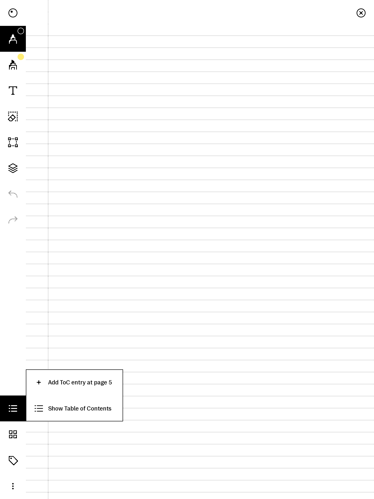
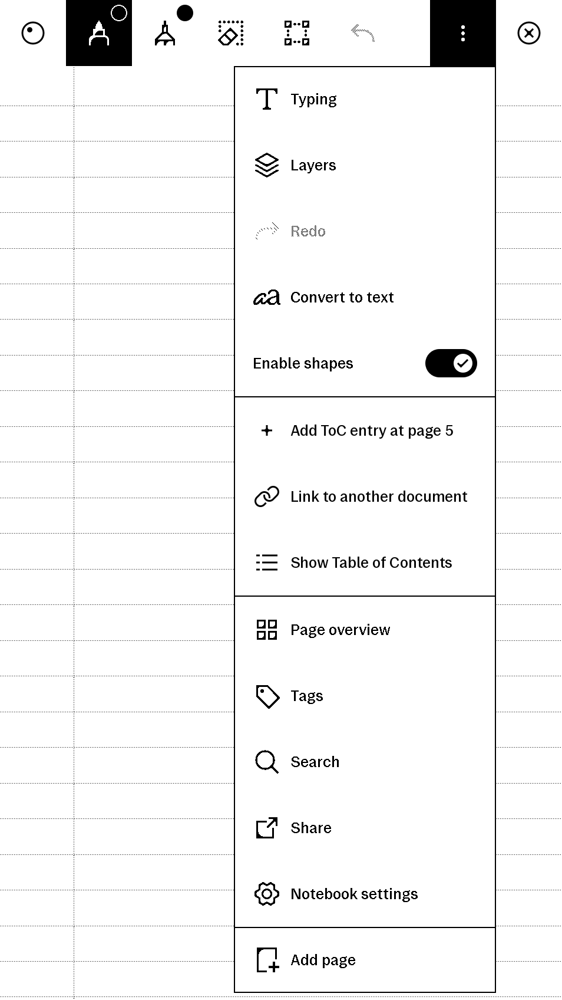
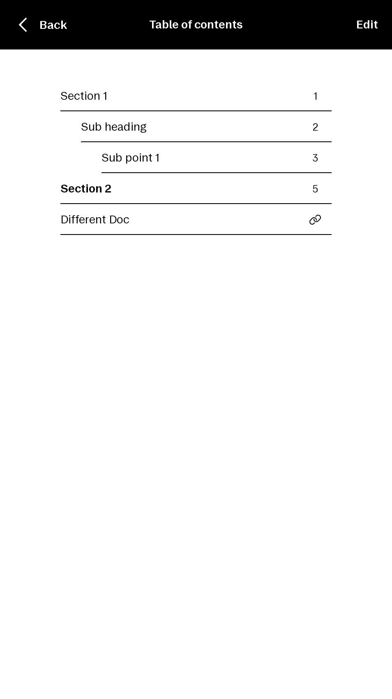

# Xovi Extensions

This repo consists of multiple xovi (.qmd) extensions that are QoL improvements to the xochitl interface. These require qt-resource-rebuilder.so to work.

Instructions to install xovi can be found [here](https://github.com/asivery/rmpp-xovi-extensions). 

Download the extensions from the folder matching your reMarkable software version. 

Copy the `.qmd` files to `/home/root/xovi/exthome/qt-resource-rebuilder/` and restart xovi.

Some of the QMD files in this repo are my own and some are modifications I've made to extensions created by others in the community. Modifications will link to the original author.

Extensions have been tested only for the latest reMarkable OS version, though they may work on newer versions.

Beta releases are not tested nor supported.

<!-- compat:begin -->
| File | reMarkable 1 | reMarkable 2 | Paper Pro | Paper Pro Move |
| ---- | :----------: | :----------: | :-------: | :------------: |
| **betterToc.qmd** | ✅ | ✅ | ✅ | ✅ |
| **createPagesPaperProSize.qmd** | ✅ | ✅ | ✅ | ✅ |
| **createPagesRM2Size.qmd** | ✅ | ✅ | ✅ | ✅ |
| **disableSelectionAutoScroll.qmd** | ✅ | ✅ | ✅ | ✅ |
| **extendListTitleWidth.qmd** | ✅ | ✅ | ✅ | ✅ |
| **fixBatteryIndicator.qmd** | ✅ | ✅ | ✅ | ✅ |
| **fixLightIndicatorGap.qmd** | ❌ | ❌ | ✅ | ✅ |
| **fixPageNumberOnSlider.qmd** | ✅ | ✅ | ✅ | ✅ |
| **gestures.qmd** | ✅ | ✅ | ✅ | ✅ |
| **hideDevModeIcon.qmd** | ✅ | ✅ | ✅ | ✅ |
| **hidePageLabelsInFullscreen.qmd** | ✅ | ✅ | ✅ | ✅ |
| **hideZoomIndicator.qmd** | ✅ | ✅ | ✅ | ✅ |
| **miniLightSleep.qmd** | ✅ | ✅ | ✅ | ✅ |
| **preventNotebookZoomOut.qmd** | ✅ | ✅ | ✅ | ✅ |
| **quickSettingsClockSerif.qmd** | ✅ | ✅ | ✅ | ✅ |
| **quickSettingsScreenshot.qmd** | ✅ | ✅ | ✅ | ✅ |
| **unlockMethodsContent.qmd** | ✅ | ✅ | ✅ | ✅ |
<!-- compat:end -->

## Extensions

### betterToc.qmd
Adds the ability to add, delete*, and edit* Table of Contents entries in notebooks, PDFs, and EPUBs.  
On-disk, ToC data is stored inside the UUID directory for the document in a toc.rm file.  
This syncs between devices via cloud sync.  
EPUB reflows can result in small amounts of drift due to limitations in progress calculation.

<table>
  <tr>
    <td></td>
    <td></td>
    <td></td>
    <td></td>
  </tr>
</table>

*Editing and deleting are limited to user-created ToC entries only

### createPagesPaperProSize.qmd
Overrides new page creation to use Paper Pro dimensions. Designed to allow better interoperability between rM2/Move and Paper Pro.  
Designed for use alongside preventNotebookZoomOut.qmd on the Move.

### createPagesRM2Size.qmd
Overrides new page creation to use reMarkable 2 dimensions. Designed to allow better interoperability between Move and reMarkable 2.  
Designed for use alongside preventNotebookZoomOut.qmd on the Move.

### disableSelectionAutoScroll.qmd
Disables the auto scrolling when moving a selection added in 3.24.

### extendListTitleWidth.qmd
Removes extra right margin for titles in list view to fill more of the available space.

### fixBatteryIndicator.qmd
Fixes a bug introduced in 3.24 with the main navigator battery icon not updating to the correct number of bars after charging while the device is asleep.

### fixLightIndicatorGap.qmd
Removes the gap reserved for the frontlight icon when the light is off on Paper Pro and Paper Pro Move.

### fixPageNumberOnSlider.qmd
3.23 and 3.24 only.  
Restores the z-index for the pageLabel element so it appears on top of the page slider like in previous versions.

### hideDevModeIcon.qmd
Hides the developer mode icon next to the battery icon.

### hidePageLabelsInFullscreen.qmd

Hides the page numbers at the bottom of the screen when the toolbar is hidden. On the very last page the page numbers are still shown. To show the page numbers slide up from the bottom to show the page slider.

### hideZoomIndicator.qmd
Auto-hides zoom indicator after 4 seconds (like the scrollbars).

### miniLightSleep.qmd

Replaces the light sleep banner with text saying "Sleeping" at the top right of the screen.

### preventNotebookZoomOut.qmd
Forces all notebook pages to start at 1x zoom with optional horizontal offset. Only affects notebooks, only affects portrait orientation. Designed for the Paper Pro Move.

### quickSettingsClockSerif.qmd

Adds a clock to the quick settings menu in serif font.

### quickSettingsScreenshot.qmd
Adds a screenshot button to the quick settings menu. 
- normal press: closes the menu and takes a screenshot.
- long-press: closes the menu and takes a screenshot with a 5 second delay.

Screenshots will be placed in `/home/root/screenshots`.  
_See required repos for supported devices._

Requires:
- [rm-shot](https://github.com/rmitchellscott/rm-shot)
- [framebuffer-spy](https://github.com/asivery/rm-xovi-extensions)
- [xovi-message-broker](https://github.com/asivery/rm-xovi-extensions)

### unlockMethodsContent.qmd
Bypasses subscription check for using on-device Methods templates and documents.

## Deprecated Extensions

### fixQuickSettingsTempSeparator.qmd 
Removes the duplicate horizontal separator in quick settings when high temp warnings are present on Paper Pro family devices.  
Fixed in 3.24.

## Modified Extensions

### gestures.qmd
**Original**: https://github.com/ingatellent/xovi-qmd-extensions

Adds the following gestures and tap areas:
- Swipe down with three fingers to reset pan and zoom, i.e. to scroll to top of the page and zoom to 100%
- Swipe out and in from the toolbar to show/hide the toolbar - for horizontal toolbar, the swipe only works at the show toolbar button (in order not to interfere with native gestures)
- When the toolbar is hidden, tap on the bottom right to scroll down, and to change to the next page if you are already nearly at the bottom) (no scrollbar shown)
- When the toolbar is hidden, tap on the bottom left to scroll up, and to change to the previous page if you are already nearly at the top) (no scrollbar shown)

PDF links in the tap area cannot be used while the toolbar is closed, show the toolbar to restore link functionality.

**Modifications I've made**
 - Removed the 4-finger contrast filter gesture

## License

- **Original works** are licensed under the MIT License (see [LICENSE](LICENSE)).
